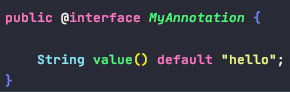
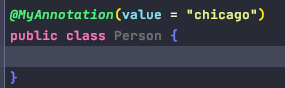

# Annotation

### Definition
    - 框架 = 注解 + 反射 + 设计模式
    - JDK5.0开始，Java增加了对元数据(meta data)的支持，即Annotation
    
    
### Use Case
    1. 生成文档相关的注解  
        - @param
        - @author
    2. 在编译时进行格式检查(JDK内置的三个基本注解)
        - @Override: 编译时校验子类重写方法的正确性，只能用于方法
        - @Deprecated: 表示修饰的元素(类，属性，构造器，方法)已过时，但仍可使用
        - @SuppressWarnings: 抑制编译器警告, eg: 变量定义后未使用
    3. 跟踪代码依赖性，实现替代配置文件的功能
        - @Component

### 自定义注解

    - 注解声明为: @interface (和interface半毛钱关系没有)
    - 内部定义成员，通常使用value表示
    - 可以指定成员的默认值，使用default定义
    - 如果自定义注解没有成员，表明是一个表示作用

    !! 自定义注解必须配上注解的信息处理流程(使用反射)才有意义
    
    
### jdk 提供的4种元注解 (修饰其他注解的注解)

    1. @Retention
        表示所修饰注解的声明周期, 以下是三个RetentionPolicy
            - SOURCE: 不会被编译, 编译前就被discard
            - CLASS: by default, 编译但不会被jvm 加载到内存中运行 
            - RUNTIME: 被编译且运行, 只有这个会被反射获取
            
    2. @Target
        表示能修饰哪些元素: CONSTRUCTOR, FIELD, LOCAL_VARIABLE, METHOD, PACKAGE, PARAMETER, TYPE
            
    3. @Documented (了解)
        表示所修饰的元素在被javadoc解析时被保留下来，默认是不保留的
        
    4. @Inherited (了解)
        表示被这个注解所修饰的类，他的所有子类也会继承这个注解

