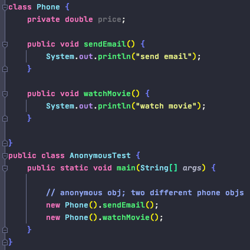
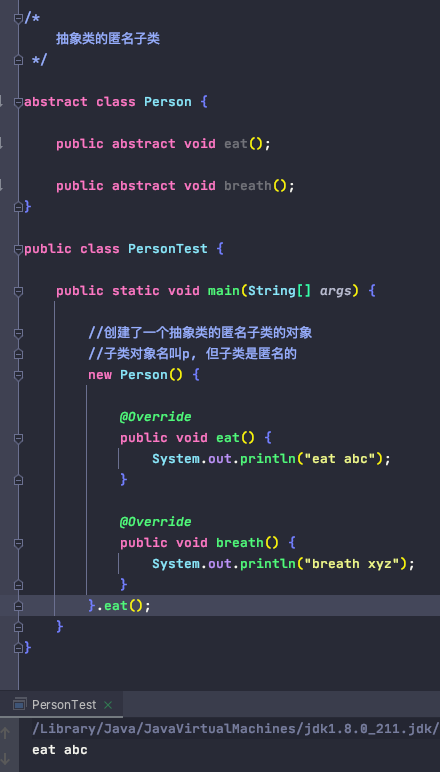
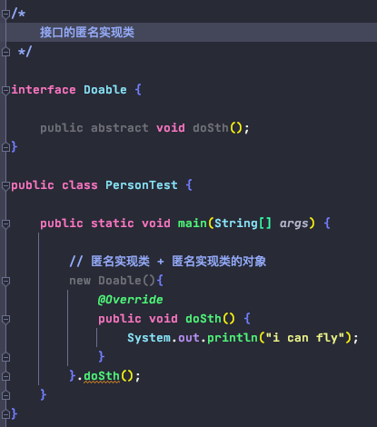

# Anonymous 
    
        - 一次性使用, 省事, 不用起名, 直接传到方法里当参数
        - 四种组合:
            a. 非匿名类的非匿名对象
            b. 非匿名类的匿名对象
            c. 匿名类的非匿名对象
            d. 匿名类的匿名对象

1. Anonymous Object 匿名对象

        - 在创建对象时没有显式地赋给一个变量名, 即为匿名对象
        - 匿名对象只能调用一次

2. 抽象类的匿名子类

        - new Anonymous_Class() {
            @Override
            method1() {...}
            
            @Override
            method2() {...}
        }

3. 接口的匿名实现类

        - new Interface () {
            @Override
            method1() {...}
            
            @Override
            method2() {...}
        }

