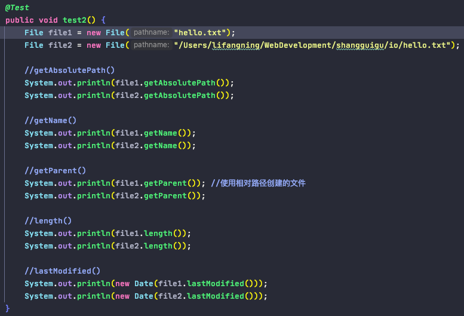
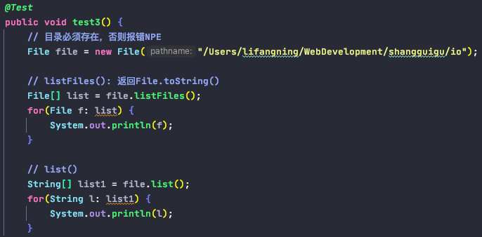
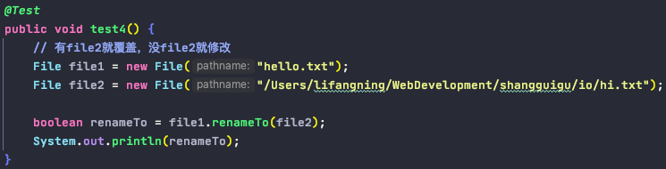
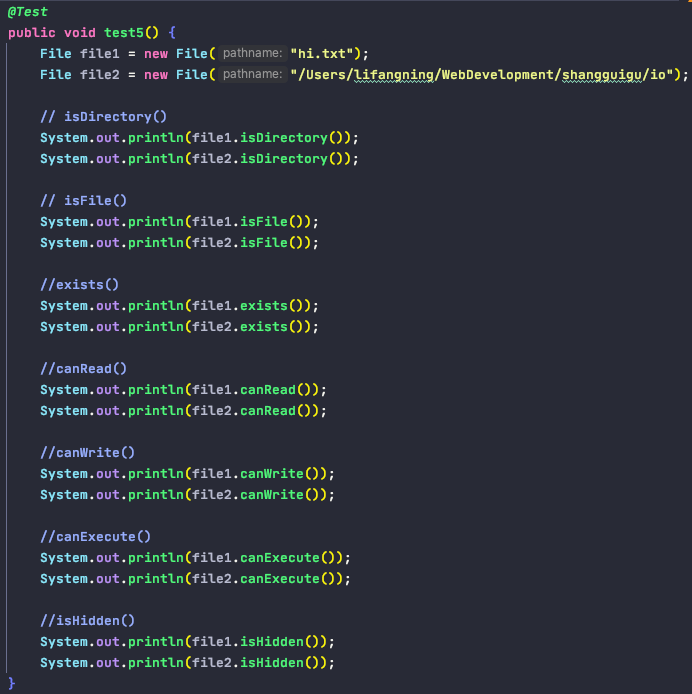
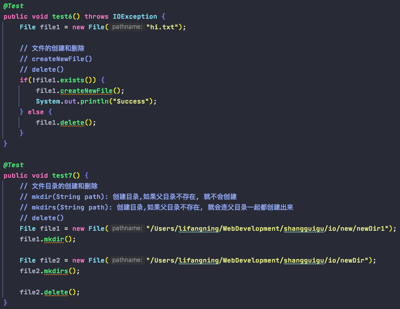

# io

1. File 类
        
        - File类的对象，代表一个文件或文件目录
        - File类声明在java.io包下
        - 实例化的3种方式: 实例化只是在内存中，还没到磁盘中
            a. File(String filePath)
            b. File(String parentPath, String childPath)
            c. File(File parentFile, String childPath)

    
       - File类中常用的方法 (并未涉及到文件内容的操作 -- io流)
       - 后续File类的对象常会作为参数传递到流的构造器中，指明读取或写入的"终点"
       
       (可以只是内存中的file对象)
          a. getAbsolutePath()
          b. getName()
          c. getParent()
          d. length()
          e. lastModified()

        
        (必须在磁盘中存在, 否则NPE)
          f. list()
          g. listFiles()

            
        (第一个文件必须存在, 否则false)
          h. renameTo(File f)

        (必须在磁盘中存在, 否则都是false)
          i. isDirectory()
          j. isFile()
          k. exists()
          l. canRead()
          m. canWrite()
          n. canExecute()
          o. isHidden()

       (在磁盘中创建/删除文件/目录)
          p. createNewFile()
          q. mkdir()
          r. mkdirs()
          s. delete()

