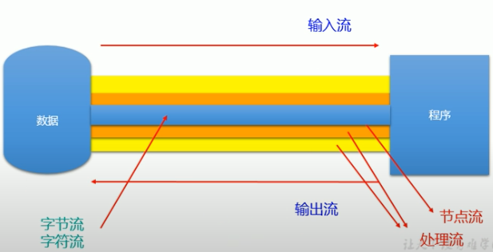
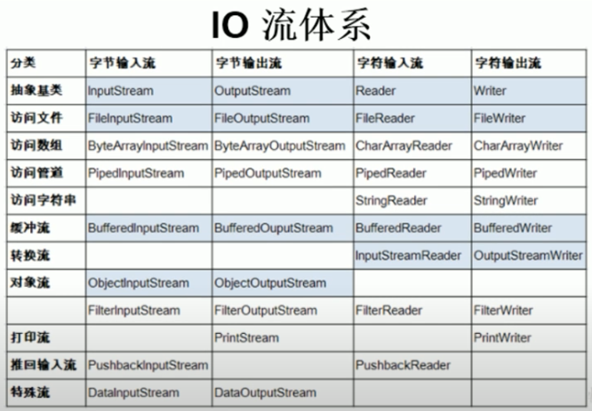
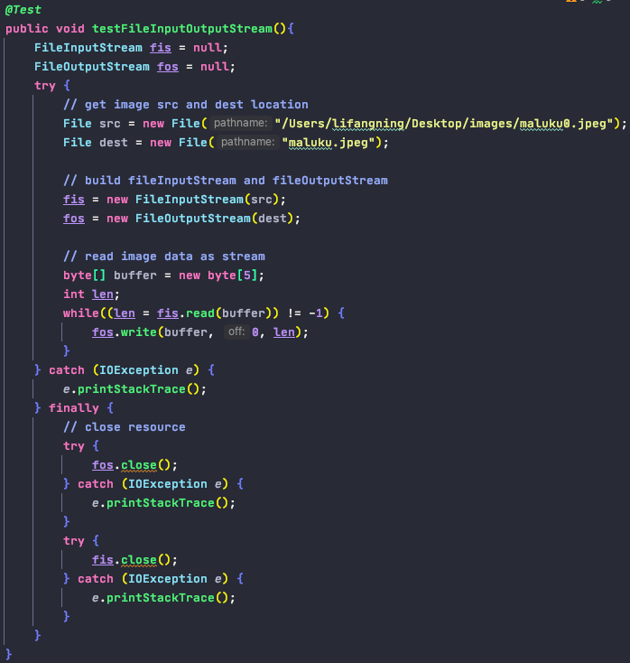
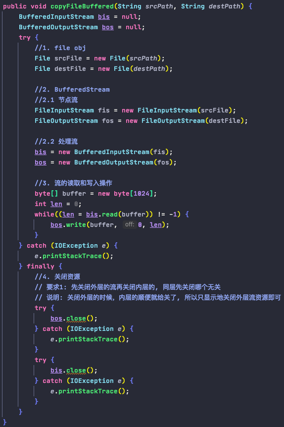
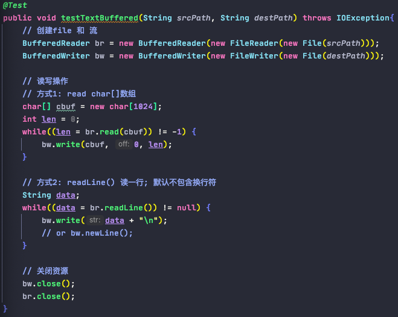

# io

1. Definition

        - 用于处理设备之间的数据传输, eg: 读/写文件, 网络传输
        - 数据的输入/输出操作是以"流(stream)"的方式进行
        - 占位在内存角度判断in/out

2. Category

        - 按操作数据单位分为: 字节流 (8 bit), 字符流 (16 bit)
        - 按数据的流向分为: 输入流, 输出流
        - 按流的角色不同分为: 节点流, 处理流 

       - 4个抽象基类: 

       - 4个节点流:
            FileInputStream
            FileOutputStream
            FileReader
            FileWriter
            
       - io流的体系结构

3. FileReader & FileWriter 
    
        0. 读/写文本型文件
            - .txt
            - .java
            - .c
            - .cpp
            ...

        1. 读的过程
            - 创建File对象
            - 创建FileReader流对象
            - 读操作
            - 关闭资源
            
        2. 写的过程
            - 创建File对象
            - 创建FileWriter流对象
            - 写操作
            - 关闭资源
            
        3. 注意事项:
            - FileReader(file)中的file对象必须存在磁盘中, 不然会报FileNotFoundException
            - 读流的时候, 常使用read(char[])的方法来提高读的效率; 该方法返回每次读取字符的个数, 每次读取是通过覆盖数组元素的方式,
                因此当获取数据中读取的元素时(eg: 写流操作), 需要指定读到哪里为止, 尤其是最后一次
            - 写流的时候, 如果写成文件不存在, 则会创建一个; 如果存在, 可以指定FileWriter的append参数为true或false; true: 即在目标文件中append新内容; false: 即覆盖掉目标文件之前的内容
            

4. FileInputStream & FileOutputStream 

        0. 读/写非文本型文件
            - .jpg/.jpg
            - .png
            - .mp3
            - .mp4
            - .avi
            - .doc
            - .ppt
            ...
            
        1. 图片的复制, 使用FileInputStream 和 FileOutputStream

5. BufferedReader & BufferedWriter & BufferedInputStream & BufferedOutputStream

        - 提高流的读取和写入的速度
            原因: 内部提供了一个缓冲区
        - 作用于已有的流之上(eg: 节点流)
        - 作为外层流, 在关闭资源时需要先被关闭, 且会自动关闭其内部的流资源
        - 写流时会自动执行 flush() 方法刷新缓冲区

       - BufferedReader 还提供了一个 readLine()方法来读取一行文本型数据,
       但不包含换行符, 输出时需要手动换行

