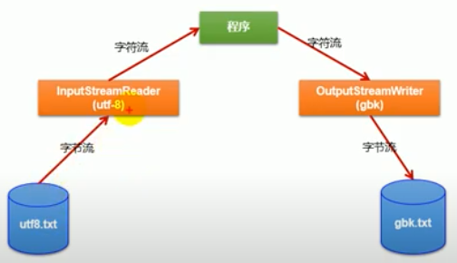
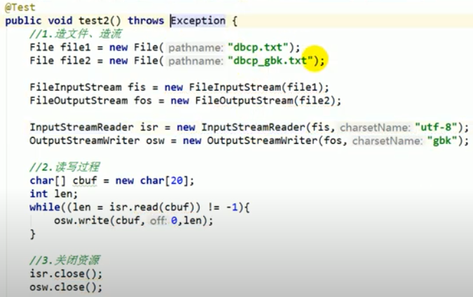
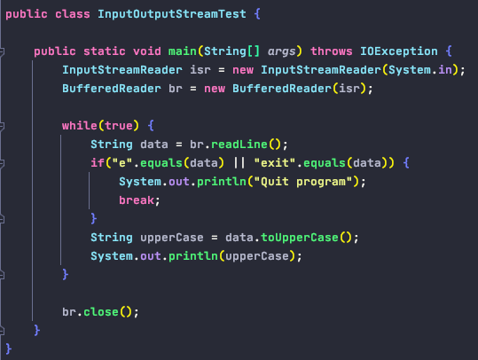
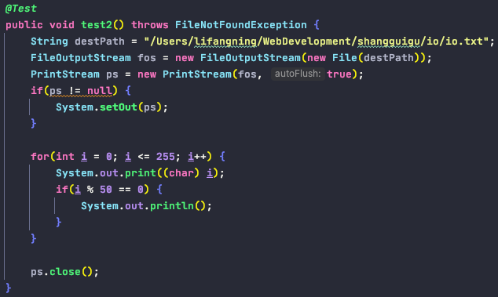
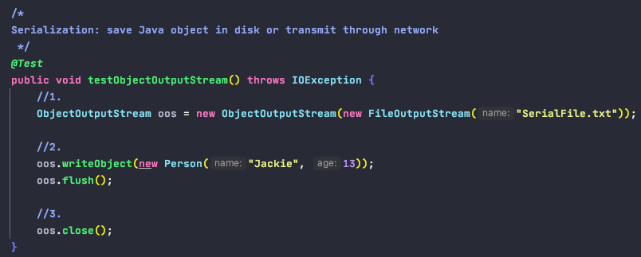
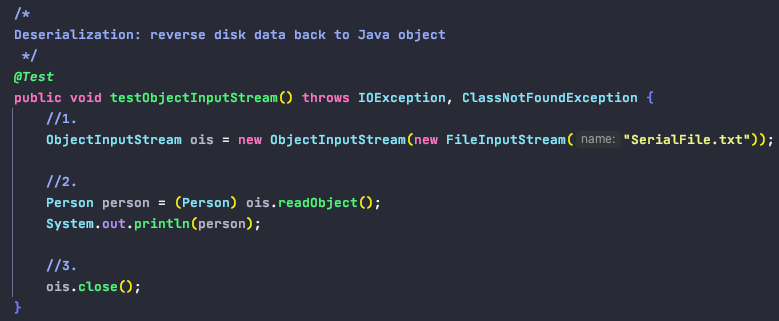

# io

0. Definition

        - 用于处理设备之间的数据传输, eg: 读/写文件, 网络传输
        - 数据的输入/输出操作是以"流(stream)"的方式进行
        - 占位在内存角度判断in/out

1. Category

        - 按操作数据单位分为: 字节流 (8 bit), 字符流 (16 bit)
        - 按数据的流向分为: 输入流, 输出流
        - 按流的角色不同分为: 节点流, 处理流 

       - 4个抽象基类: 

       - 4个节点流:
            FileInputStream
            FileOutputStream
            FileReader
            FileWriter
            
       - io流的体系结构

2. 流的标准化写入/写出过程

        读的过程
            - 创建File对象源, 或path字符串 (文件必须存在)
            - 创建输入流对象
            - 读操作 read(buffer)
            - 关闭资源 (try-catch-finally)

        写的过程
            - 创建File对象, 或path字符串 (若不存在就新建; 若存在either覆盖or追加)
            - 创建输出流对象
            - 写操作 write(buffer, 0, len)
            - 关闭资源 (try-catch-finally)

3. FileReader & FileWriter 
    
        0. 读/写文本型文件
            - .txt
            - .java
            - .c
            - .cpp
            ...
            
        1. 注意事项:
            - FileReader(file)中的file对象必须存在磁盘中, 不然会报FileNotFoundException
            - 读流的时候, 常使用read(char[])的方法来提高读的效率; 该方法返回每次读取字符的个数, 每次读取是通过覆盖数组元素的方式,
                因此当获取数据中读取的元素时(eg: 写流操作), 需要指定读到哪里为止, 尤其是最后一次
            - 写流的时候, 如果写成文件不存在, 则会创建一个; 如果存在, 可以指定FileWriter的append参数为true或false; true: 即在目标文件中append新内容; false: 即覆盖掉目标文件之前的内容
            

4. FileInputStream & FileOutputStream 节点流

        0. 读/写非文本型文件
            - .jpg/.jpg
            - .png
            - .mp3
            - .mp4
            - .avi
            - .doc
            - .ppt
            ...
            
        1. 图片的复制, 使用FileInputStream 和 FileOutputStream

5. BufferedReader & BufferedWriter & BufferedInputStream & BufferedOutputStream 缓冲流

        - 提高流的读取和写入的速度
            原因: 内部提供了一个缓冲区
        - 作用于已有的流之上(eg: 节点流)
        - 作为外层流, 在关闭资源时需要先被关闭, 且会自动关闭其内部的流资源
        - 写流时会自动执行 flush() 方法刷新缓冲区

       - BufferedReader 还提供了一个 readLine()方法来读取一行文本型数据,
       但不包含换行符, 输出时需要手动换行

6. InputStreamReader & OutputStreamWriter 转换流

        - 提供在字节流和字符流之间的转换
        - InputStreamReader: 将InputStream转换为Reader (解码)
        - OutputStreamWriter: 将Writer转换为OutputStream (编码)

7. <了解即可> System.in & System.out 标准的输入/ 输出流

        - System.in 标准的输入流, 默认从键盘输入, 是字节流, 需要转化成字符流
        - System.out 标准的输出流, 默认从控制台输出

        

8. <了解即可> PrintStream & PrintWriter 打印流

        - 提供了一系列重载的 print() 和 println()方法
        - 可以设置打印的位置, 默认是控制台, 也可以设置打印到其他文件中

9. ObjectInputStream (Deserialization) & ObjectOutputStream (Serialization)
        
        - 对象流: 用于存储和读取基本数据类型或对象的处理流. 它的强大之处就是可以把Java中的
            对象写入到数据源中, 也能把对象从数据源中还原回来

        - 对象序列化机制: 允许内存中的Java对象转换成平台无关的二进制流, 从而允许把这种二进制流持久地保存在磁盘上, 或通过网络将这种二进制流传输到
            另一个网络节点. 当其他程序获取这种二进制流, 就可以恢复成原来的Java对象

        - 需要序列化的对象的要求:
            1. 其类必须继承如下的两个接口之一:
                a. Serializable (marker interface)
                b. Externalizable
            2. 其类内部必须提供一个全局常量:
                public static final long serialVersionUID = 123L;
            
            当反序列化的时候, 需要这个全局常量来确定还原成哪个类的对象;
            如果先前没有声明serialVersionUID, 在序列化后时 系统会自动生成一个serialVerionUID, 
            如果之后对类的内部做了改动, 系统会生成一个新的serialVersionUID,
            这时反序列化的对象的serialVersionUID就和改动后的类的serialVersionUID不匹配而无法正常
            地被反序列化, 从而抛出InvalidClassException
            
            3. 除了当前对象类需要实现Serializable接口之外, 还必须保证其内部所有属性也必须是可序列化的,
            默认情况下, 基本数据类型和String类型都可序列化; 如果有其他自定义类型对象, 则那个类也要执行Serializable接口

            4. 无法序列化被static和transient修饰的成员变量
