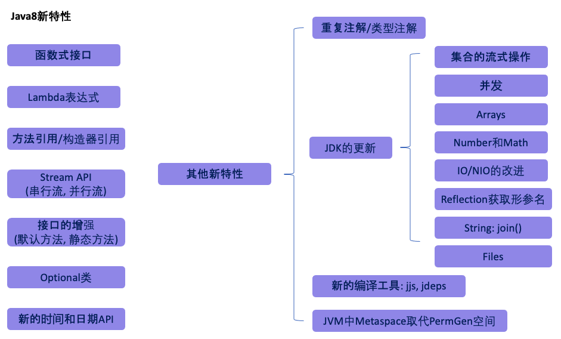
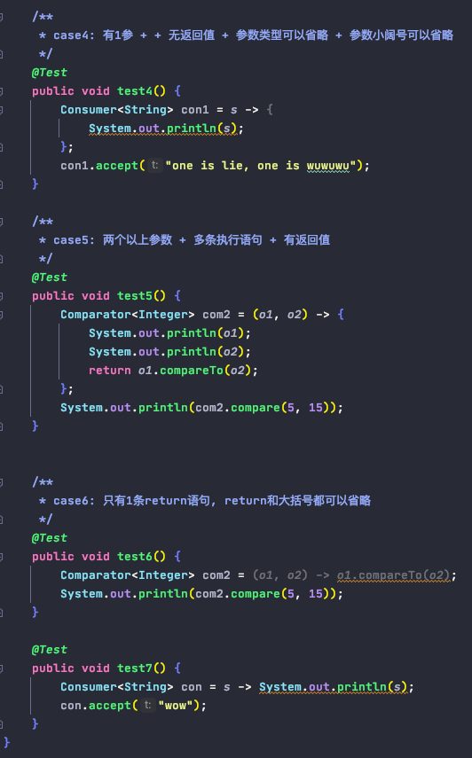

# Java 8的新特性

0. Overview

        

1. Lambda表达式

        Lambda表达式的本质: 作为接口的实例, 必须是函数式接口(即只有一个抽象方法)
            1). 左边: 形参列表
                    - 如果lambda形参列表只有一个参数, 一堆()可以省略; 
                    - 多于一个时, 不能省略
                    - 参数类型往往可以省略
            2). 右边: lambda体
                    - 应该使用{}进行包裹
                    - 如果只有一条执行语句, 则{}可以省略, 以及return关键字 (如果{}省了, return一定省掉!!)

                    
2. Functional Interface 函数式接口

