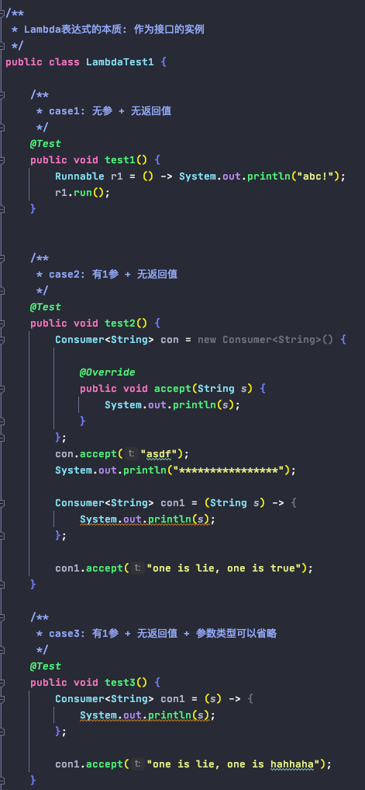

# Java 8的新特性

0. Overview

        

1. Lambda表达式
            
            1). 总结：
                    - 本质: 函数式接口的实例化
                    - 以前用匿名实现类表示的现在都可以用lambda表达式来做
                    - 函数式接口: 必须是函数式接口(即只有一个抽象方法)
            1). 左边: 形参列表
                    - 如果lambda形参列表只有一个参数, 一堆()可以省略; 
                    - 多于一个时, 不能省略
                    - 参数类型往往可以省略
            2). 右边: lambda体
                    - 应该使用{}进行包裹
                    - 如果只有一条执行语句, 则{}可以省略, 以及return关键字 (如果{}省了, return一定省掉!!)

                    
2. Functional Interface 函数式接口

        - 如果一个接口中只声明了一个抽象方法, 则为函数式接口
        - annotation: @FunctionalInterface
        - 在java.util.function包下定义了java 8的丰富的函数式接口
        - java内置的4大核心函数式接口
            1). 消费型接口 Consumer<T>,    void accept(T t)
            2). 供给型接口 Supplier<T>,    T get()
            3). 函数型接口 Function<T, R>, R apply(T t)
            4). 断定型接口 Predicate<T>,   boolean test(T t)

3. 方法引用:
        
        - 本质: 函数式接口的实例化
        - 使用要求: 接口中的抽象方法的形参列表和返回值类型与方法引用的方法的形参列表和返回值类型相同!!
        - 三种使用场景:
            1) 对象 ：： 非静态方法

    
            2) 类 ：： 静态方法

            
            3) 类 ：： 非静态
                ...

4. Stream API
        
        参考: https://zhuanlan.zhihu.com/p/71134330
        
        1). 定义:
                - 函数式编程风格
                - 它可以对指定的集合进行各种复杂操作, eg: 复杂的查找, 过滤和映射数据等
                - 类似使用SQL执行的数据库查询, 但实际处理的常是NoSQL数据库的数据源
                - Stream关注的是对数据的运算, 与CPU打交道; 集合关注的数据存储, 与内存打交道
        2). 注意点:
                - Stream自己不会存储数据
                - Stream不会改变数据源对象, 相反, 他们会返回一个持有结果的新的Stream
                - Stream操作是延迟执行的, 这意味着他们会等到需要结果的时候才执行; 产生结果后不能再被使用
        3). Stream执行流程:
                Stream实例化 ---> 一系列链式中间操作(过滤, 映射 ...) ---> 终止操作
        
        4). Stream的执行
        
            a. Stream实例化 (四种方式)
            

           b. Stream的中间操作 : 多个中间操作可以连接形成一个流水线, 除非流水线上触发终止操作, 否则中间操作不会执行任何处理!!
                    而终止操作时一次性全部处理, 称为“惰性求值”
                    
                - 中间操作: 过滤(filter), 去重(distinct), 截取前#个(limit), 跳过前#个(skip)
                

        
                - 中间操作: 映射(map), 扁平映射(flatMap)

                - 中间操作: 排序(sort)
                

                
                - 终止操作: 匹配与查找(match & search)

                - 终止操作: 规约(reduce)
                

                
                - 终止操作: 收集(collect)

