# Multithread

0. intro
    
        1). 线程, 进程, 程序
        2). 线程的创建 & 使用 (4中方式创建) *****
        3). 线程的声明周期 *** 
        4). 线程同步 (解决线程安全问题, 3种方式) *****
        5). 线程间通信 ***

1. 线程, 进程, 程序

        1). running program = process, process是动态的, 会占用系统资源, 每个进程有独立的方法区和堆空间; 
            program是静态的(没有加载到内存中, 没有cpu参与运算, 只是默默存在磁盘中)
        2). thread: 程序内部的一条执行路径, 每条线程都有独立的运行栈和pc寄存器, 线程之间切换的开销很小; 一个进程会有多条线程, 共享内存资源(方法区, 堆空间), 多线程之间通信很方便, 但会产生线程安全隐患(线程同步)
        3). 一个java.exe至少有三个线程, main线程, gc线程, 异常处理线程
        4). 线程的分类: 
                - 用户线程 & 守护线程
                - 守护线程时用来服务用户线程的, 通过在start()方法前调用thread.setDaemon(true)可以把一个用户线程变成一个守护线程
                - Java垃圾回收就是一个典型的守护线程
                - 若用户线程结束了, 则守护线程也会结束
        5). 并行 vs 并发: 
                - 并行: 多个cpu同时执行多个任务
                - 并发: 一个cpu同时执行多个任务(时间切片快速切换)
        6). 何时需要多线程:
            
            首先, 以单核cpu执行多个任务为例, 单线程的执行完所有任务的速度要比"多线程"同时执行完多个任务速度快, 由于cpt切换线程会占用大量cpu资源
            
            单线程CPU如何执行"多线程"?
                - 单核cpu同一时间只能处理1个线程, 只有1个线程在执行
                - 多线程同时执行: 其实是cpu快速在多个线程之间切换造成的假象
                - cpu调度线程的时间足够快, 就造成了这种"多线程"的假象
                - 如果线程非常多, cpu会在n个线程之间切换, 消耗大量的cpu资源
            
            a. 需要同时执行两个或多个任务, eg: main线程, gc线程, 异常处理线程
            b. 执行一些需要等待的任务, eg: 用户输入, 文件读写, 网络操作, 搜索等以提高用户体验, case: 用户滑动手机时(thread_1)另一条线程(thread_2)负责装载新的page content
            
            
2. 线程的创建

        方式一: 继承Thread类
            - 创建一个类继承Thread类
            - 重写Thread类的run()方法, 子线程要做的事就放在这里
            - 创建这个子类的对象
            - 子类对象调用start()方法
            
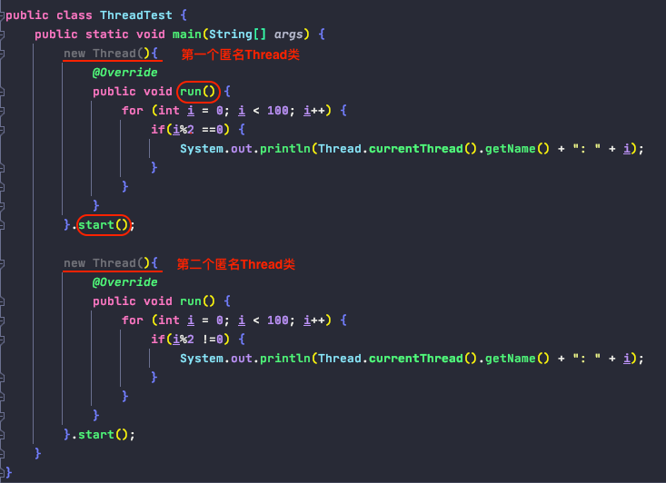

            注意: 
                a. start()的作用: 
                    - 启动子线程
                    - 调用子线程的run()方法
                b. 不能直接调用run()方法, 相当于没有多线程执行
                c. start()方法只能start一次, 不能让已经启动执行的子线程再start()子线程
                
                
        方式二: 实现Runnable接口
            - 创建一个实现了Runnable接口的类
            - 这个类要重写Runnable中的抽象方法: run()
            - 创建这个类的对象
            - 将这个对象作为参数传递到Thread类的构造器中, 创建Thread类对象
            - 通过Thread类对象调用start()
 
 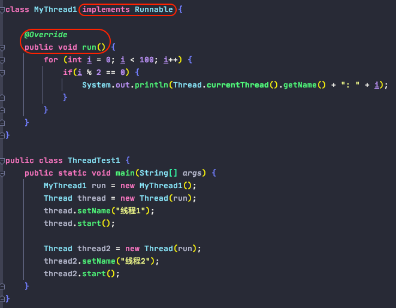
 
 
 对比创建线程的两种方式:
 
        - 开发中: 优先选择: 实现Runnable接口的方式
        - 原因: 
                a. 实现接口的方式没有类的单继承性的局限性
                b. 实现接口的方式更适合来处理多线程共享数据的情况(天然共享)
                
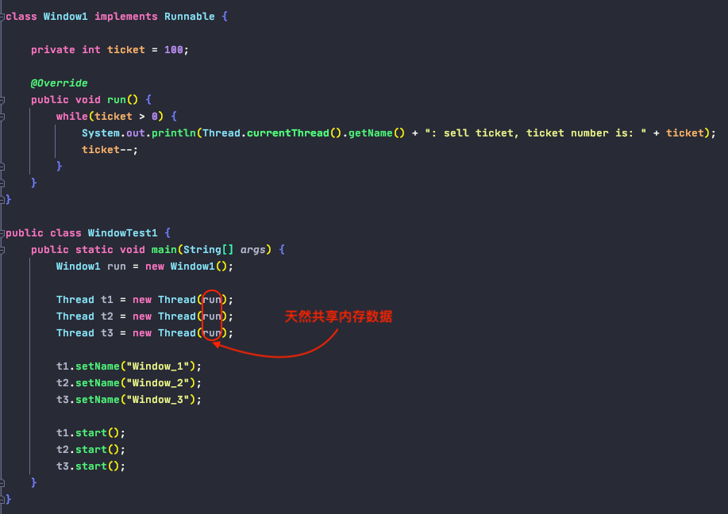

3. 线程常用方法

        1). start(): start current thread; call current thread's run() method
        2). run(): needed to be overwritten in thead class
        3). currentThread(): static method of Thread class, return current executing thread
        4). getName(): get current thread's name
        5). setName(): set current thread's name
        6). yield(): 释放当前cpu的执行权, 当然有可能在下一刻又被分配给了执行权
        7). join(): 在线程a中调用线程b的join(), 此时线程a就进入阻塞状态, 直到线程b完全执行完以后, 线程a才结束阻塞状态
        8). sleep(long milliseconds): 让当前线程睡眠(阻塞)指定的毫秒数, 结束后等待cpu重新分配资源
        9). stop(): @Deprecated
        10). isAlive(): 某个线程当下是否存活
        
        
4. 线程的优先级

        1). cpu的调度策略
            - 时间片(timeslice)
            - 抢占式: 高优先级的线程抢占CPU
            
        2). Java的调度方法
            - 同优先级的线程组成先进先出队列, 使用时间片策略
            - 对于高优先级, 使用优先调度的抢占式策略
            
        3). 优先级选择
            - MAX_PRIORITY: 10
            - MIN_PRIORITY: 1
            - NORM_PRIORITY: 5
        
        4). 获取和设置线程优先级
            - getPriority(): 获取线程的优先级
            - setPriority(): 设置线程的优先级
            
            说明: 高优先级的线程要抢占低优先级线程的cpu执行权, 但是只是从概率上来讲, 
            高优先级的线程有更高的概率被优先执行, 但并不意味着一定是高优先级的线程先执行完以后, 低优先级的线程才会执行

5. 线程的生命周期

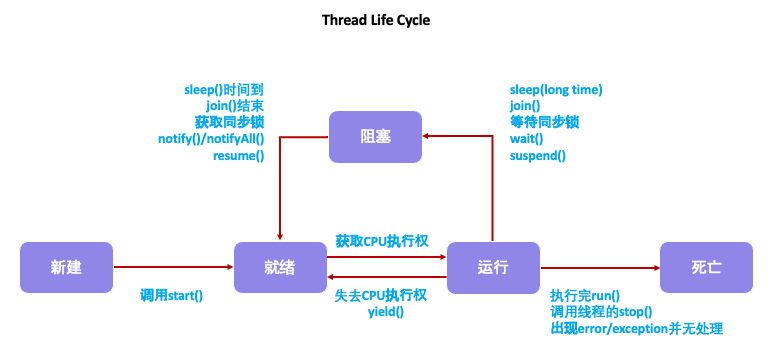

6. 线程的安全问题

        1). 线程安全:
                - 当多个线程访问某个方法时, 不管你通过怎样的调用方式或者说这些线程如何交替的执行, 我们在主线程中不需要去做任何的同步, 这个类的结果行为都是我们设想的正确行为, 那我们就可以说这个类是线程安全的
        2). 线程不安全的原因: 
                - 当某个线程在操作某个共享变量的过程中, 操作尚未完成时, 其他线程也进入并操作此数据, 导致结果出现异常
        3). 如何解决:
                - 当某个线程在操作某个共享变量的过程中, 其他线程不能参与进来, 直到本线程操作完变量, 其他线程才可以开始操作变量, 这种情况下, 即使本线程出现了阻塞也不能改变

7. 线程的同步

         方式一: 同步代码块
        
            synchronized(同步监视器) {
                需要被同步的代码, 即操作共享数据(堆区, 方法区)的代码 !!!!!!!!!!
                同步监视器: 俗称, 锁 🔐, 任何一个类的对象都可以充当锁
                     要求: 多个线程必须共用同一把锁 !!!!!!!!!!!
            }
            
            synchronized的优势:
                - 解决了线程安全的问题
            
            synchronized的劣势:
                - 操作同步代码时, 只能有一个线程参与, 其他线程等待, 相当于一个单线程的过程, 效率低
                
                
             1). 同步代码块处理实现Runnable接口
            
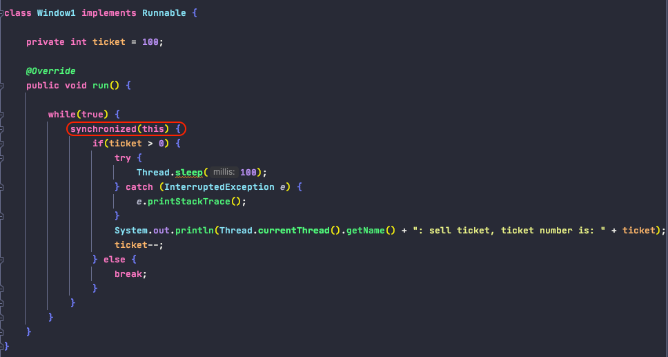
            
            2). 同步代码块处理继承Thread类
            
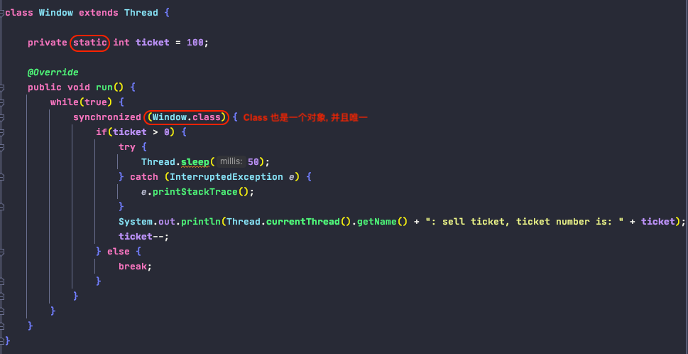
        
        方式二: 同步方法
                - 仍然会涉及到同步监视器, 只是不需要我们显示声明
                - 非静态的同步方法, 同步监视器是: this
                - 静态的同步方法, 同步监视器是: 当前类本身
        
        
            1). 同步方法处理实现Runnable接口
            
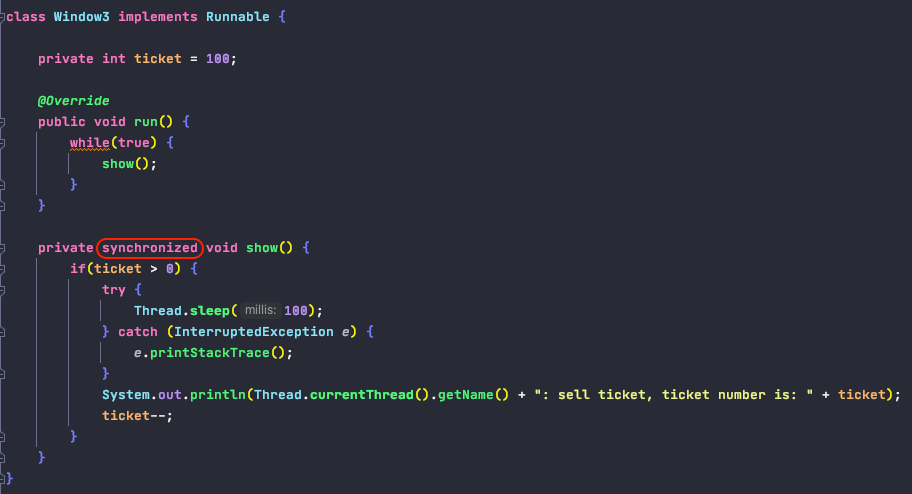
            
            2). 同步方法处理继承Thread类

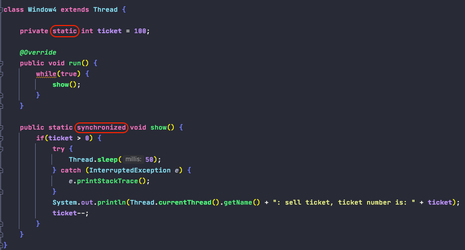
    
    
        方式三: JDK5.0之后的新特性
        
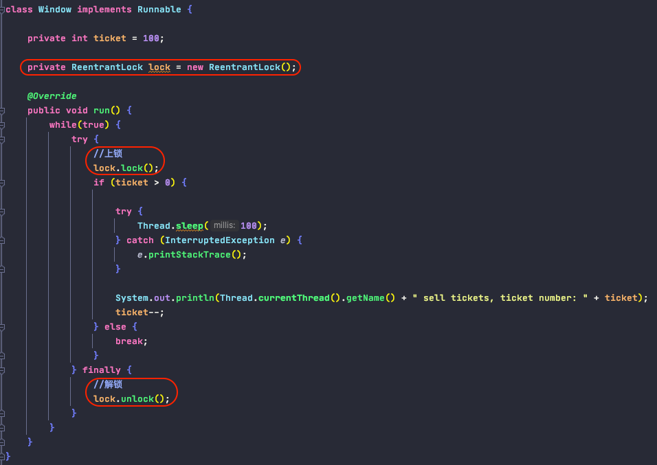
    
        对比synchronized 和 lock:
            - lock是显式锁(手动开启和关闭锁), synchronized是隐式锁, 出了同步作用域后自动释放
            - lock只有代码块锁, synchronized有代码块锁和方法锁
            - 使用lock锁, JVM将花费较少的时间来调度线程, 性能更好, 并且具有更好的扩展性(提供更多的子类)
    
    
8. 单例模式懒汉式的线程安全的高效写法: 

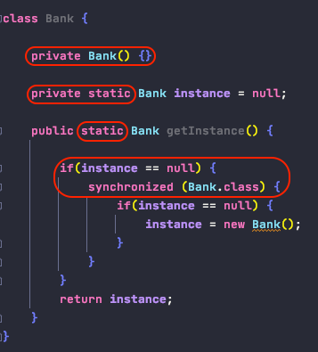

9. Dead Lock 死锁

        - 不同的线程分别占用对方需要的同步资源不放弃, 都在等待对方放弃自己需要的同步资源, 就形成了线程的死锁
        - 出现死锁后, 不会出现异常, 不会出现提示, 只是所有的线程都处于阻塞状态, 无法继续
        - 我们使用同步时要尽量避免死锁:
            * 使用专门的算法, 原则
            * 尽量减少同步资源的定义
            * 尽量避免嵌套同步
    
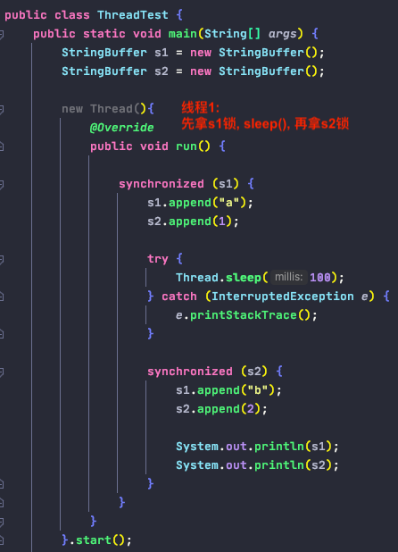

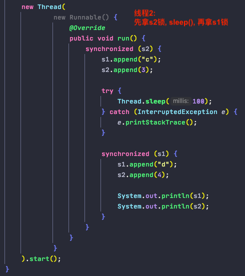

10.  线程间的通信

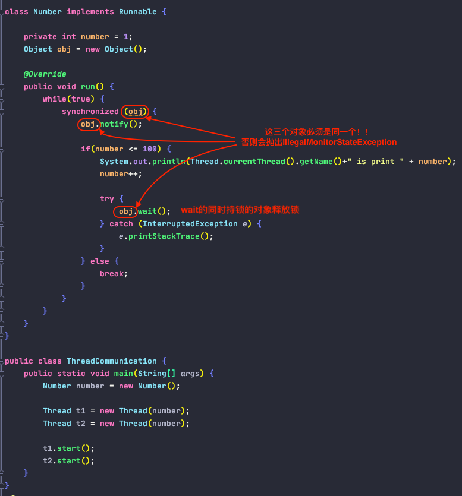

    1). 三个常用方法：
            - wait(): 一旦执行此方法, 当前线程就进入阻塞状态, 并释放同步监视器
            - notify(): 一旦执行此方法, 就会唤醒被wait的线程; 如果有多个线程被wait, 就会唤醒优先级高的那个
            - notifyAll(): 一旦执行此方法, 就会唤醒所有被wait的线程
            
    2). 需求: 
            - 这三个方法必须使用在同步代码块或同步方法中
            - 这三个方法的调用者必须是同步代码块或同步方法中的同步监视器, 否则会出现IllegalMonitorStateException异常
            - 这三个方法定义在java.lang.Object类当中

    3). 对比wait()和sleep():
            相同点:
                - 一旦执行wait()或sleep()都会使当前线程进入阻塞状态
            
            不同点: *****
                a. 两个方法声明的位置不同: 
                    - Thread类中声明sleep()
                    - Object类中声明wait()
                b. 调用的范围不同: 
                    - sleep()可以在任何需要的场景下调用
                    - wait()必须使用在同步代码块或同步方法中调用
                c. 关于是否同步监视器: 如果两个方法都使用在同步代码块或同步方法中
                    - sleep()不会释放锁
                    - wait()会释放锁
                
    4). 经典案例 -- 生产者/消费者问题
    
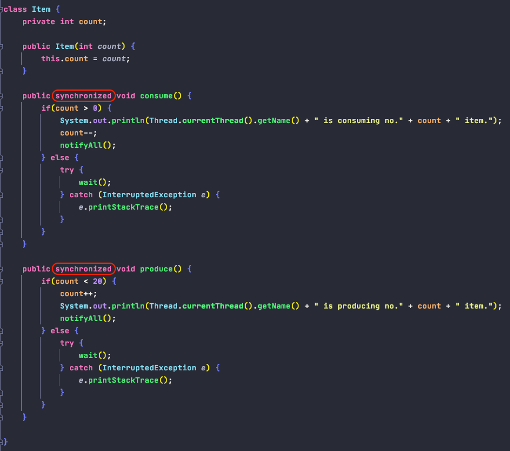

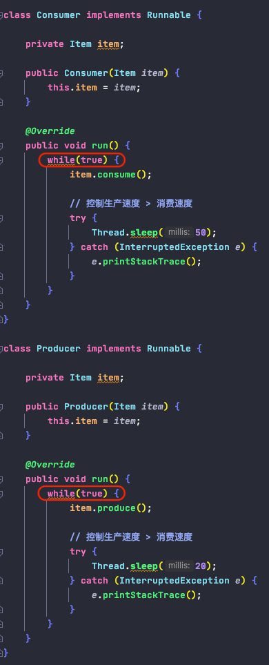

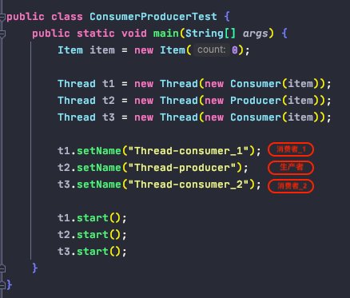
        
            
