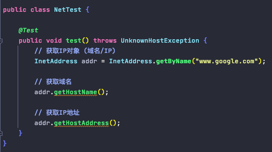
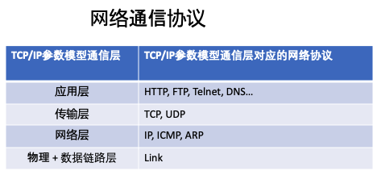
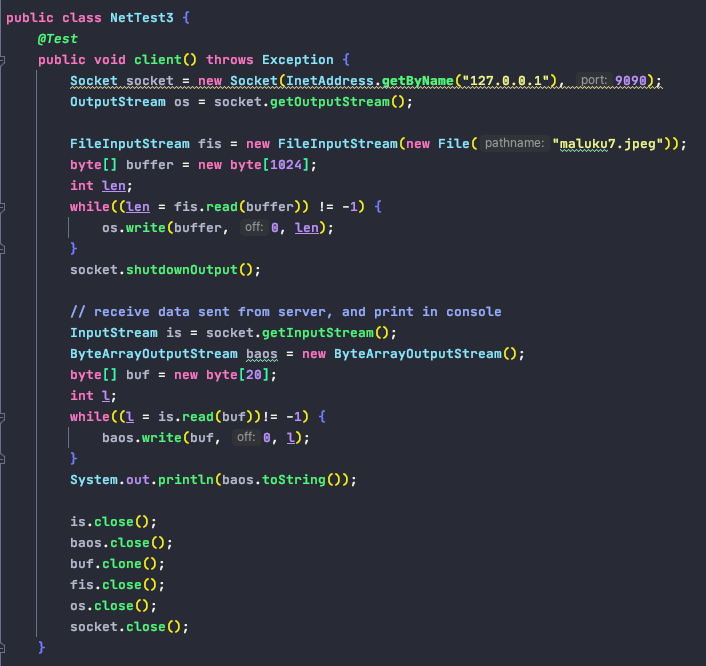
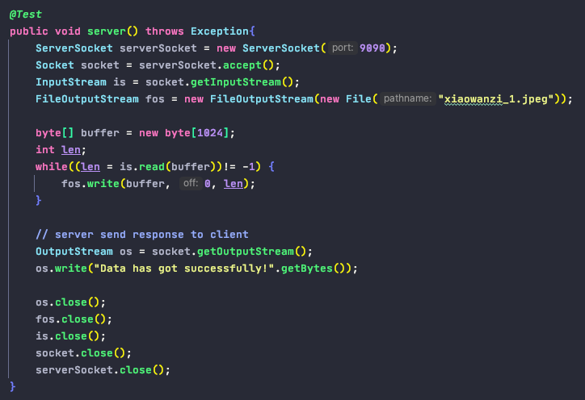

# 网络编程

1. Definition
        
        把分布在不同地理区域的计算机与专门的外部设备用通信线路连成一个规模大, 功能强的网络系统, 从而使众多计算机可以方便地互相传递信息, 共享硬件, 软件, 数据信息等资源

2. Basic

        1). IP和端口号 (定位主机/应用地址), 端口号和IP地址组合得到一个网络套接字: Socket

        
        2). 网络通信协议 (网络通信规则)
    

    

3. TCP & UDP

        TCP协议:
            - 使用TCP协议前, 须先建立TCP连接, 形成传输数据通道
            - 传输前, 采用“三次握手”的方式, 点对点通信, 是可靠的传输
            - TCP协议进行通信的两个应用进程: 客户端 + 服务端
            - 在连接中可进行大数据量的传输
            - 传输完毕, 需要释放已建立的连接"四次挥手", 效率低
        
        UDP协议:
            - 将数据, 源, 目的封装成数据包, 不需要建立连接
            - 每个数据包的大小限制在64K以内
            - 发送不管对方是否准备好, 接收方收到也不确认, 因而是不可靠的
            - 可以广播发送
            - 发送数据结束时无需释放资源, 开销小, 速度快

4. TCP 网络编程 - socket编程

