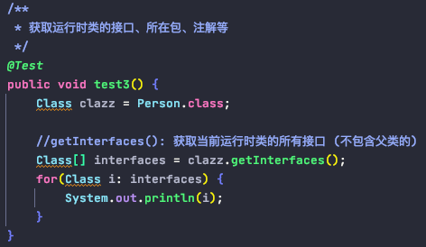
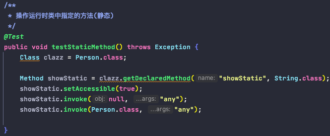

# Reflection
        
0. Definition:
    
        - Java程序在运行状态中(runtime), 对于任意一个类，都可以在运行时知道这个类的
        全部属性和方法; 对于任意一个对象，都可以调用他的任意属性和方法; 这种动态获取信息
        以及动态调用对象方法的功能成为Java语言的反射机制。
    
1. why

        - 动态性
        
2. what
    
        - 在运行时判断任意一个对象所属的类
        - 在运行时构造任意一个类的对象
        - 在运行时"判断"任意一个"类"所具有的成员变量和方法
        - 在运行时"调用"任意一个"对象"的成员变量和方法
        - 在运行时处理注解
        - 在运行时获取泛型信息
        - 生成动态代理

3. 反射相关的主要API

        - java.lang.Class
        - java.lang.reflect.Method
        - java.lang.reflect.Field
        - java.lang.reflect.Constructor
        
4. Simple Case

5. java.lang.Class 类

        - 类的加载过程: java.exe命令对某个字节码文件进行解释运行时， JVM会将编译后的.class文件加载到内存中
        - Class的实例: 内存中被加载的这些类就是"运行时类"，作为Class的实例
        - 获取运行时类的 4种 方式: 

6. 哪些类型可以有Class对象

        - 外部类，成员内部类，静态内部类，局部内部类，匿名内部类
        - interface 接口
        - []: 数组
        - enum: 枚举
        - annotation: 注解
        - primitive type: 基本数据类型
        - void
        - Object
        - Class 

7. 反射的使用场景
        
        - a(*****).创建运行时类的对象 (eg: 框架中大量使用反射，容器通过反射创建JavaBean, 子类继承父类时保证调用super()时，父类有此无参构造器) (框架)
            - clazz.newInstance()

           动态性的体现

       - b(*).获取运行时类的内部属性，以及属性的内部结构(权限修饰符, 返回值类型, 属性名)
            - clazz.getFields()
            - clazz.getDeclaredFields()
            - field.getModifiers()
            - field.getType()
            - field.getName()

       - c(*).获取运行时类的内部方法，以及方法的内部结构(注解 权限修饰符 返回值类型 方法名 (参数类型1 形参名1 ...) 异常)
            - clazz.getMethods()
            - clazz.getDeclaredMethods()
            - method.getAnnotations()
            - method.getModifiers()
            - method.getReturnType()
            - method.getName()
            - method.getParameterTypes()
            - method.getExceptionTypes()

       - d(*).获取运行时类的构造器，以及构造器的内部结构(省略，同方法)
            - clazz.getConstructors()
            - clazz.getDeclaredConstructors()

       - e(*****).获取运行时类的父类, 以及父类的泛型  (DAO<T>)
            - clazz.getSuperClass()
            - clazz.getGenericSuperClass()
            - (ParameterizedType)genericSuperclass.getActualTypeArguments()

       - f(*****).获取运行时类的所有接口, 不包含父类的接口 (代理模式)
            - clazz.getInterfaces()

       - g(*).获取运行时类所在的包
            - clazz.getPackage()

                
                
       - h(*****).获取运行时类的注解 (框架)
            - clazz.getAnnotations()

    
    
       - i(****).操作运行时类的属性
            - clazz.getDeclaredField("")
            - field.setAccessible(true)
            - field.set(newInstance, "val")
            - field.get(newInstance)

    
       - j(****).操作运行时类的方法(静态 或 非静态)
            - clazz.getDeclaredMethod("")
            - method.setAccessible(true)
            - method.invoke(newInstance, param..)
            - staticMethod.invoke(Person.class, param..)

